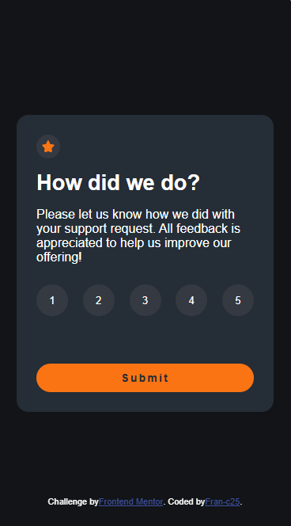
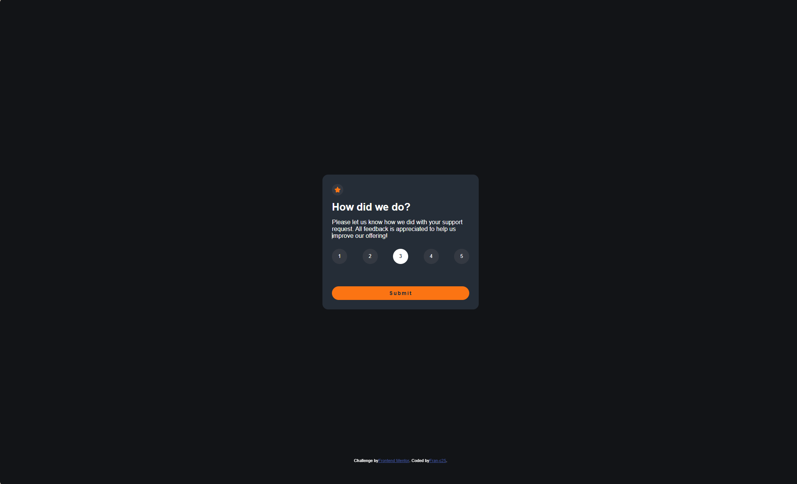

# Frontend Mentor - Interactive rating component solution

This is a solution to the [Interactive rating component challenge on Frontend Mentor](https://www.frontendmentor.io/challenges/interactive-rating-component-koxpeBUmI). Frontend Mentor challenges help you improve your coding skills by building realistic projects. 

## Tabla de contenidos

- [Resumen](#overview)
  - [El desafío](#el-desafío)
  - [Captura de pantalla](#screenshot)
  - [Enlaces](#links)
  - [Construido con](#construido-con)
  - [Qué aprendí](#qué-aprendí)
- [Autor](#autor)


## Overview

Este proyecto es una solución al desafío del componente de calificación interactiva de Frontend Mentor. Consiste en una tarjeta de calificación interactiva donde los usuarios pueden seleccionar una puntuación del 1 al 5 y, al enviarla, ver una pantalla de agradecimiento que muestra la opción elegida.


### El desafío
Los usuarios deberían poder:

- Ver el diseño óptimo de la aplicación según el tamaño de la pantalla de su dispositivo.

- Ver los estados de hover (al pasar el cursor) para todos los elementos interactivos de la página.

- Seleccionar y enviar una calificación numérica.

- Ver el estado de la tarjeta de agradecimiento ("Thank you") después de enviar una calificación.

### Screenshot
- Captura de pantalla del resultado:
-Mobile:

-Desktop:


### Links

- Solution URL: [Add solution URL here](https://your-solution-url.com)
- Live Site URL: [https://calificacion-interactiva-frontendment.netlify.app/](https://calificacion-interactiva-frontendment.netlify.app/)

### Construido con

- Marcado HTML5 semántico
- Propiedades personalizadas de CSS (Variables)
- Flexbox para el diseño y alineación del componente
- Enfoque "Mobile-first" y media queries para diseño responsivo
- JavaScript para la manipulación del DOM y lógica interactiva

### Qué aprendí

En este proyecto, mejoré significativamente en el uso de JavaScript para la manipulación dinámica del DOM y el manejo de estados de la interfaz de usuario:

1. **Manipulación de clases y estados activos:** Aprendí a iterar sobre un grupo de botones usando `.forEach` para eliminar y agregar clases de CSS dinámicamente (`classList.remove('active')` y `classList.add('active')`), controlando cuál calificación está seleccionada.
2. **Validación de entradas:** Implementé una validación sencilla que muestra un mensaje de error si el usuario intenta enviar la calificación sin haber seleccionado una opción previa.
3. **Alternancia de vistas:** Utilicé propiedades de estilo dinámicas desde JS para ocultar la tarjeta de puntuación y mostrar la pantalla de agradecimiento con la calificación seleccionada.

Aquí el código que controla la selección del botón y limpia los mensajes de error:

```js
options.forEach(button => {
    button.addEventListener('click', () => {
        // Remueve la clase activo de todos los botones
        options.forEach(btn => btn.classList.remove('active'));
        // Agrega la clase activo al botón clicado
        button.classList.add('active');
        // Guarda el valor seleccionado
        eleccion = button.textContent.trim();
        // Borra cualquier mensaje de error anterior si existe
        errorMessage.textContent = "";
    });
});
```


## Autor
- Frontend Mentor - [fran-c25](https://www.frontendmentor.io/profile/fran-c25)
- GitHub - [fran-c25](https://github.com/fran-c25)

